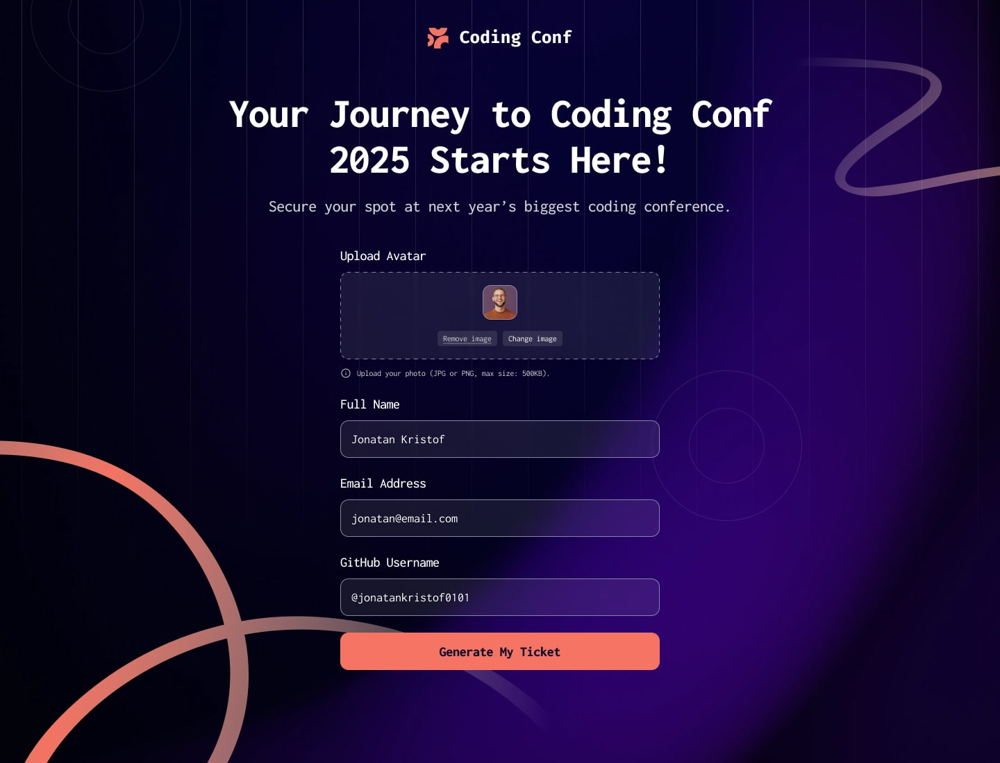

# Frontend Mentor - Conference ticket generator solution

This is a solution to the [Conference ticket generator challenge on Frontend Mentor](https://www.frontendmentor.io/challenges/conference-ticket-generator-oq5gFIU12w). Frontend Mentor challenges help you improve your coding skills by building realistic projects. 

## Table of contents

- [Overview](#overview)
  - [The challenge](#the-challenge)
  - [Screenshot](#screenshot)
  - [Links](#links)
- [My process](#my-process)
  - [Built with](#built-with)
- [Author](#author)


**Note: Delete this note and update the table of contents based on what sections you keep.**

## Overview

### The challenge

Users should be able to:

- Complete the form with their details
- Receive form validation messages if:
  - Any field is missed
  - The email address is not formatted correctly
  - The avatar upload is too big or the wrong image format
- Complete the form only using their keyboard
- Have inputs, form field hints, and error messages announced on their screen reader
- See the generated conference ticket when they successfully submit the form
- View the optimal layout for the interface depending on their device's screen size
- See hover and focus states for all interactive elements on the page

### Screenshot



### Links

- Solution URL: [https://github.com/bhuvi819381/Conference-Ticket-Generator.git]
- Live Site URL: [https://bhuvi819381.github.io/Conference-Ticket-Generator]

## My process

### Built with

- Semantic HTML5 markup
- CSS custom properties
- Flexbox
- Desktop-first workflow

## Scripts

Use the following scripts for your development workflow:

```bash
# Start the development server
npm run dev

# Checks your code for any linting errors
npm run lint

# Tries to automatically fix any linting errors present in your code
npm run lint:fix

# Formats your code in a consistent, predefined style using Prettier
npm run format

# Build for production
npm run build

# Preview the build
npm run preview

# Build and preview the project
npm run buildpreview
```

## Author

- Frontend Mentor - [@bhuvi819381](https://www.frontendmentor.io/profile/bhuvi819381)
- Twitter - [@bhuvi819381](https://www.twitter.com/bhuvi819381)